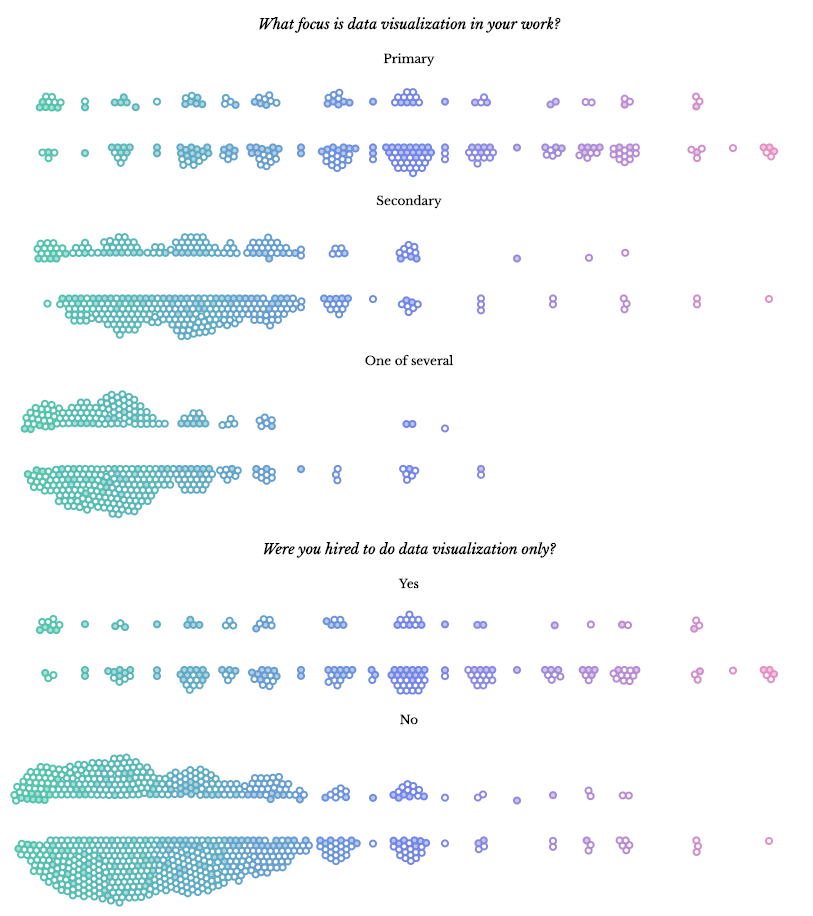

# Os tesouros do Tesouro

Visualizações dos dados das pessoas do Tesouro

## Inspirações

### Shirley ❤️

* Viz: http://sxywu.com/community/
* Article: https://medium.com/visualizing-the-field/655-frustrations-doing-data-visualization-e1087c8176fc
* Write-up: http://www.datasketch.es/april/
* Code for beeswarm: https://bl.ocks.org/sxywu/e1f0938ce926562e8fd69b100b03e58c

### Shirley, de novo, para o logo transformado em pontos

* Tweet: https://twitter.com/sxywu/status/1217165438594867200
* Project: https://t.co/JSDGpJa9lC?amp=1
* Relevant code: https://github.com/sxywu/tweety/blob/master/scripts/components/Content.jsx#L80-L100
* Key term: Atkinson [dithering](https://en.wikipedia.org/wiki/Dither)

### Ali Torban and Sonja Kuipers

https://dataviztoday.com/shownotes/28

### Video Robert Kosara sobre Unit Charts / Dot Plots

https://www.youtube.com/watch?v=xXOK-K2m6A0

